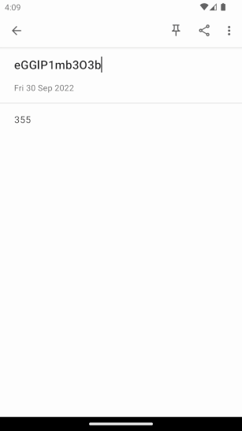
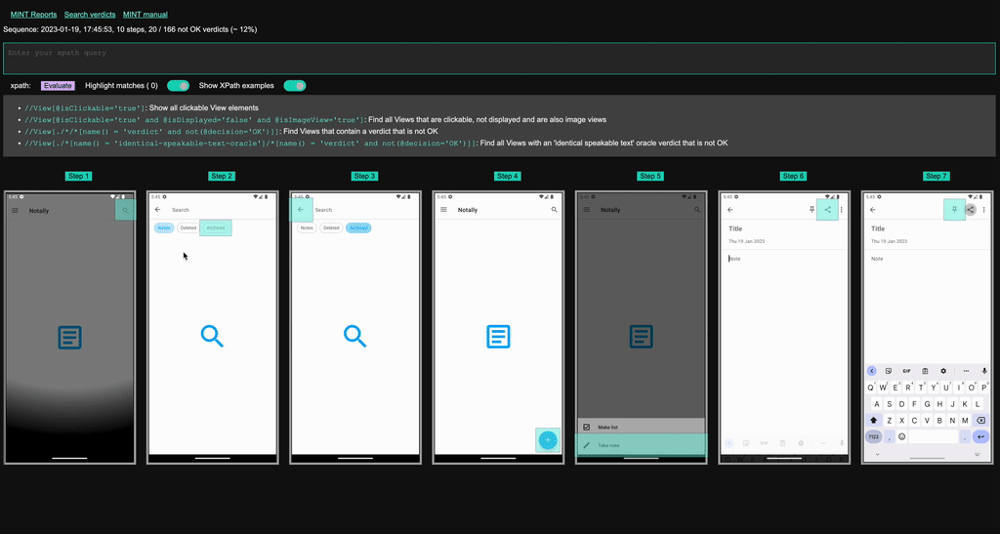

# 🌿 MINT | [Demo](docs/demo.md) | [Features](docs/manual.md) | [Contributing](docs/contributing.md) | [Get Started](docs/android.md)

## Explore and test all user interactions that impact Customer Experience (CX)
Do you recognise this problem statement?

 _To be confident about CX I would need to explore and test all user interactions that impact the CX. However, I don’t do that because my current test solutions are not scalable: I would have to write and maintain a lot more test scripts and do a lot more manual clicking than I do now. Already my current testing actions takes so much time and effort that it is one of my main bottlenecks for fast releasing.
It’s a growing challenge because applications demand a) faster releases, b) more and more features and c) more changes._

If that's the case, MINT is something for you!

## Why MINT? 
* MINT improves and speeds up your testing activities.
* MINT helps you to learn about which interactions impact CX (‘CX smell’).
* MINT can replace parts of functional testing, manual testing, performance testing and accessibility testing: choose which are tests are useful for you. 
* MINT’s reporting gives you high confidence, helps finding the root causes.  
* MINT helps interpreting the state of the System Under Test (SUT). 

## What is MINT

A recording demonstrating how MINT can be used, including a high level explanation on how it works, has been shown at NWO ICT Open 2023. You can find this recording by clicking on the image below. 

MINT is a testing tool complementary to existing testing tooling. It uses a probabilistic model that applies (customizable) rules to detect and (de)prioritize UI interactions during action selection. Because of this, we can automatically explore native Android applications without requiring human interaction to create and maintain test scripts. During exploration, we leverage so called oracles to measure the desired behavior of the system under test. These oracles produce verdicts, which records something about a specific of the SUT. All these oracles are composable, providing a continuous and multidimensional measurement of your SUT. A reporting tool allows for interactive exploration of the recorded system interactions, providing insight in the specific behaviour of the SUT. By interpreting these verdicts, the general quality and the CX then be improved. This work draws inspiration from the [TESTAR](https://github.com/TESTARtool/TESTAR_dev) community. 

Main characteristics of MINT:  

* Easy to use 
* Automated
* Data-driven 
* Plug & play 
* Generic 
* Fun! 

## Getting started with MINT
There are only a few general steps, no customization for your app is needed. It takes a few minutes to get a report for your tool or your module. To learn more on _what_ MINT is and how it works, we refer to [this manual](docs/manual.md). On _how_ to [get started with Android we refer here](docs/android.md).

## About us
We believe in tooling made by engineers, designed for engineers, that is Open Source and finally that creating a software product should be fun. 

We include engineers in an early stage, we have conducted interviews exploring the current problems and solutions. We want to be in contact with our users as much as possible: all input is valuable. 

An early prototype related to the approach this tool applies is published as [_Scriptless GUI testing on Android and iOS applications_ published at the _22nd IEEE International Conference on Software Quality, Reliability, and Security (QRS 2022)_](https://doi.org/10.1109/QRS57517.2022.00113).

## Development roadmap
MINT currently only support Native Android apps by providing a library built on top of Espresso. 

For now MINT supports few test probes, but we welcome any contribution. If you want to add your own, let us know how we can help. 

Note that at the current stage, this tool is not production ready, and serves more as a research vehicle for academia. Nevertheless, we believe that productising this work requires limited effort. You could consider this an alpha quality release. 

## Contributing
We welcome contributions of any kind! See [contributing.md](docs/contributing.md) for details. 

## Demo
See [our demo page](docs/demo.md) for more details.

Below is a screen recording of MINT interacting with an Android application. 

Here is a quick demonstration of the reporting tool that can be used to interactively explore any of the recorded tests _after_ execution of the tests has finished. 

