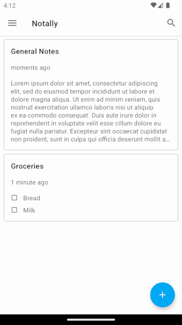

# 🌿 [MINT](/README.md) | Demo | [Features](manual.md) | [Contributing](contributing.md) | [Get Started](android.md)

## Configuring a simple test
```kotlin
package org.mint.exampleapp

import androidx.test.ext.junit.rules.ActivityScenarioRule
import androidx.test.ext.junit.runners.AndroidJUnit4
import org.junit.Rule
import org.junit.Test
import org.junit.runner.RunWith
import org.mint.MINTRule

@RunWith(AndroidJUnit4::class)
class ExampleMintTest  {
    @Rule
    @JvmField
    var activityScenarioRule = ActivityScenarioRule(MainActivity::class.java)

    @Rule
    @JvmField
    var mint = MINTRule()

    @Test
    fun mintExampleTestRun() {
        mint.explore()
    }
}
```

## Interacting with the application
Below you can see what happens when you execute the above test. Note that more nuanced navigational strategies can be applied. 


## Reporting tool
Finally, traces can be explored with the included reporting tool. It can be used to interactively explore any of the recorded tests _after_ execution of the tests has finished. 

